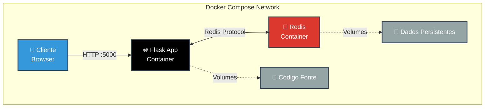
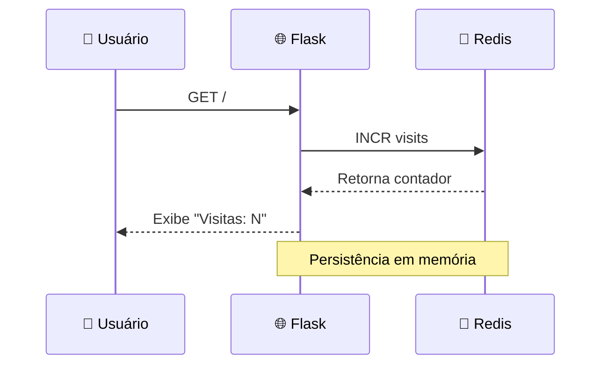

# 🐳 Flask + Redis + Docker Compose

<div align="center">

[](https://flask.palletsprojects.com/)
[](https://redis.io/)
[](https://www.docker.com/)
[](https://www.python.org/)

**🚀 Aplicação web containerizada demonstrando orquestração de microsserviços com Docker Compose**

*Projeto educacional focado em arquitetura de contêineres e comunicação entre serviços*

[🎯 Visão Geral](#-visão-geral) • [🏗️ Arquitetura](#️-arquitetura) • [⚡ Início Rápido](#-início-rápido) • [📚 Aprendizados](#-aprendizados-técnicos) • [📞 Contato](#-contato)

---

</div>

## 🎯 Visão Geral

> **Aplicação web full-stack containerizada para demonstração de conceitos avançados de Docker e orquestração de microsserviços**

Este projeto implementa uma arquitetura de microsserviços simples mas completa, utilizando **Flask** para o backend web e **Redis** como banco de dados em memória. Toda a infraestrutura é orquestrada através do **Docker Compose**, demonstrando práticas modernas de DevOps e containerização.

### ✨ Características Principais

<table align="center">
<tr>
<td align="center" width="33%">
<h3>🐳 Containerização</h3>
<p>Aplicação totalmente containerizada com Docker</p>
</td>
<td align="center" width="33%">
<h3>🔄 Orquestração</h3>
<p>Gestão automática de múltiplos serviços</p>
</td>
<td align="center" width="33%">
<h3>🚀 Deploy Rápido</h3>
<p>Um comando para subir toda infraestrutura</p>
</td>
</tr>
<tr>
<td align="center" width="33%">
<h3>💾 Persistência</h3>
<p>Dados mantidos no Redis em memória</p>
</td>
<td align="center" width="33%">
<h3>🌐 Networking</h3>
<p>Comunicação segura entre contêineres</p>
</td>
<td align="center" width="33%">
<h3>⚙️ Configurável</h3>
<p>Variáveis de ambiente e volumes</p>
</td>
</tr>
</table>

---

## 🏗️ Arquitetura

### 📊 Diagrama de Infraestrutura



### 🔧 Stack Tecnológica Completa

<div align="center">

| **Camada** | **Tecnologia** | **Versão** | **Função** |
|------------|---------------|-----------|-----------|
| **🌐 Web** |  | 2.3+ | Framework web Python |
| **💾 Cache** |  | 7.0+ | Banco em memória |
| **🐳 Container** |  | Latest | Runtime de contêineres |
| **🎼 Orquestração** |  | 2.0+ | Gestão multi-container |
| **🐍 Runtime** |  | 3.9+ | Linguagem base |

</div>

### 🏛️ Estrutura de Arquivos

```
📦 flask-docker-compose/
├── 🐳 Dockerfile                 # Imagem customizada da aplicação
├── 🎼 docker-compose.yml         # Orquestração de serviços
├── 🐍 app.py                     # Aplicação Flask principal
├── 📋 requirements.txt           # Dependências Python
├── 📁 .dockerignore             # Exclusões no build
└── 📖 README.md                  # Esta documentação
```

---

## ⚡ Início Rápido

### 📋 Pré-requisitos

<div align="center">

| Ferramenta | Versão Mínima | Download |
|------------|---------------|----------|
|  | 20.10+ | [docker.com](https://www.docker.com/get-started) |
|  | 2.0+ | Incluído no Docker Desktop |
|  | 2.30+ | [git-scm.com](https://git-scm.com/) |

</div>

### 🚀 Instalação em 3 Passos

```bash
# 1️⃣ Clone o repositório
git clone https://github.com/seu-usuario/flask-docker-compose.git
cd flask-docker-compose

# 2️⃣ Inicie os containers (build automático)
docker-compose up --build

# 3️⃣ Acesse a aplicação
# Abra seu navegador em: http://localhost:5000
```

### 🎮 Comandos Úteis

```bash
# 🏃 Iniciar aplicação (modo detached)
docker-compose up -d

# 📊 Ver logs em tempo real
docker-compose logs -f

# 🔍 Status dos containers
docker-compose ps

# 🛑 Parar aplicação
docker-compose stop

# 🗑️ Remover containers e rede
docker-compose down

# 🔄 Rebuild completo
docker-compose up --build --force-recreate

# 🧹 Limpeza total (incluindo volumes)
docker-compose down -v
```

---

## 🎯 Funcionalidades

### 📊 Sistema de Contagem de Visitas

<div align="center">



</div>

### ⚙️ Características Técnicas

| **Feature** | **Descrição** | **Benefício** |
|-------------|---------------|---------------|
| **🔄 Auto-reload** | Hot reload do Flask em desenvolvimento | Produtividade aumentada |
| **💾 Persistência** | Dados mantidos no Redis | Contagem preservada |
| **🌐 Network Isolada** | Rede Docker privada | Segurança aumentada |
| **📦 Volumes** | Montagem de código fonte | Desenvolvimento ágil |
| **🔧 Environment Vars** | Configuração via variáveis | Flexibilidade de setup |
| **🚀 Health Checks** | Verificação automática de saúde | Alta disponibilidade |

---

## 🔧 Configuração Avançada

### 📝 Arquivo `docker-compose.yml`

```yaml
version: '3.8'

services:
  # 🌐 Serviço Web Flask
  web:
    build: .
    ports:
      - "5000:5000"
    environment:
      - FLASK_ENV=development
      - REDIS_HOST=redis
    volumes:
      - .:/app
    depends_on:
      - redis
    networks:
      - app-network

  # 💾 Serviço Redis
  redis:
    image: redis:7-alpine
    ports:
      - "6379:6379"
    volumes:
      - redis-data:/data
    networks:
      - app-network

# 🌐 Definição da rede
networks:
  app-network:
    driver: bridge

# 💽 Volumes persistentes
volumes:
  redis-data:
```

### 🐳 Dockerfile Otimizado

```dockerfile
# Imagem base leve
FROM python:3.9-slim

# Metadados
LABEL maintainer="seu-email@example.com"
LABEL description="Flask + Redis Application"

# Diretório de trabalho
WORKDIR /app

# Dependências do sistema
RUN apt-get update && apt-get install -y --no-install-recommends \
    gcc \
    && rm -rf /var/lib/apt/lists/*

# Instalar dependências Python
COPY requirements.txt .
RUN pip install --no-cache-dir -r requirements.txt

# Copiar código da aplicação
COPY . .

# Expor porta
EXPOSE 5000

# Comando de inicialização
CMD ["python", "app.py"]
```

### 🐍 Código da Aplicação (`app.py`)

```python
from flask import Flask, render_template_string
import redis
import os

app = Flask(__name__)

# Configuração do Redis
redis_host = os.getenv('REDIS_HOST', 'redis')
redis_port = int(os.getenv('REDIS_PORT', 6379))
redis_client = redis.Redis(host=redis_host, port=redis_port, decode_responses=True)

# Template HTML moderno
HTML_TEMPLATE = '''
<!DOCTYPE html>
<html lang="pt-BR">
<head>
    <meta charset="UTF-8">
    <meta name="viewport" content="width=device-width, initial-scale=1.0">
    <title>Flask + Redis Counter</title>
    <style>
        * { margin: 0; padding: 0; box-sizing: border-box; }
        body {
            font-family: 'Segoe UI', Tahoma, Geneva, Verdana, sans-serif;
            background: linear-gradient(135deg, #667eea 0%, #764ba2 100%);
            min-height: 100vh;
            display: flex;
            justify-content: center;
            align-items: center;
        }
        .container {
            background: white;
            padding: 3rem;
            border-radius: 20px;
            box-shadow: 0 20px 60px rgba(0,0,0,0.3);
            text-align: center;
            max-width: 500px;
        }
        h1 {
            color: #333;
            margin-bottom: 1rem;
            font-size: 2.5rem;
        }
        .counter {
            font-size: 4rem;
            color: #667eea;
            font-weight: bold;
            margin: 2rem 0;
            animation: pulse 2s infinite;
        }
        @keyframes pulse {
            0%, 100% { transform: scale(1); }
            50% { transform: scale(1.1); }
        }
        .info {
            color: #666;
            margin-top: 2rem;
            font-size: 0.9rem;
        }
        .badge {
            display: inline-block;
            padding: 0.5rem 1rem;
            background: #667eea;
            color: white;
            border-radius: 20px;
            margin: 0.5rem;
            font-size: 0.8rem;
        }
    </style>
</head>
<body>
    <div class="container">
        <h1>🐳 Flask + Redis</h1>
        <p style="color: #666; margin-bottom: 2rem;">Contador de Visitas Containerizado</p>
        <div class="counter">{{ visits }}</div>
        <p style="color: #333; font-size: 1.2rem;">visitas registradas</p>
        <div class="info">
            <div class="badge">🐍 Flask</div>
            <div class="badge">💾 Redis</div>
            <div class="badge">🐳 Docker</div>
        </div>
    </div>
</body>
</html>
'''

@app.route('/')
def home():
    # Incrementa o contador
    visits = redis_client.incr('visit_counter')
    return render_template_string(HTML_TEMPLATE, visits=visits)

@app.route('/health')
def health():
    """Endpoint de health check"""
    try:
        redis_client.ping()
        return {'status': 'healthy', 'redis': 'connected'}, 200
    except:
        return {'status': 'unhealthy', 'redis': 'disconnected'}, 503

if __name__ == '__main__':
    app.run(host='0.0.0.0', port=5000, debug=True)
```

---

## 📚 Aprendizados Técnicos

### 🎓 Conceitos Demonstrados

<div align="center">

| **Área** | **Conceitos Aplicados** | **Nível** |
|----------|------------------------|-----------|
| **🐳 Docker** | Containerização, Multi-stage builds, Layers | ⭐⭐⭐ |
| **🎼 Compose** | Orquestração, Networks, Volumes | ⭐⭐⭐ |
| **🌐 Networking** | Bridge networks, Service discovery | ⭐⭐ |
| **💾 Persistência** | Volumes, Data management | ⭐⭐ |
| **🔧 DevOps** | CI/CD ready, Environment configs | ⭐⭐⭐ |
| **🐍 Python** | Flask framework, Redis integration | ⭐⭐ |

</div>

### 📖 Tópicos Estudados

#### 🐳 **Docker Fundamentals**
- ✅ Criação de `Dockerfile` otimizado com multi-stage builds
- ✅ Gestão de camadas e cache de builds
- ✅ Boas práticas de segurança em imagens
- ✅ Otimização de tamanho de imagens

#### 🎼 **Docker Compose**
- ✅ Definição de serviços multi-container
- ✅ Configuração de redes isoladas
- ✅ Gestão de volumes persistentes
- ✅ Variáveis de ambiente e configuração
- ✅ Dependências entre serviços

#### 🌐 **Networking**
- ✅ Comunicação inter-container via DNS
- ✅ Exposição seletiva de portas
- ✅ Isolamento de rede para segurança
- ✅ Service discovery automático

#### 💾 **Data Management**
- ✅ Volumes nomeados vs bind mounts
- ✅ Persistência de dados em Redis
- ✅ Backup e recuperação de volumes
- ✅ Gestão de estado em containers

---

## 🔍 Monitoramento e Debugging

### 📊 Comandos de Inspeção

```bash
# 🔍 Inspecionar container específico
docker inspect flask-docker-compose_web_1

# 📊 Estatísticas de recursos em tempo real
docker stats

# 🐚 Acessar shell do container Flask
docker-compose exec web /bin/bash

# 💾 Acessar CLI do Redis
docker-compose exec redis redis-cli

# 📝 Ver últimas 50 linhas de log
docker-compose logs --tail=50 web

# 🔄 Seguir logs em tempo real
docker-compose logs -f web redis
```

### 🐛 Troubleshooting Comum

| **Problema** | **Causa** | **Solução** |
|--------------|-----------|-------------|
| Porta 5000 ocupada | Outro serviço usando a porta | `docker-compose down && lsof -ti:5000 \| xargs kill` |
| Redis não conecta | Container Redis não iniciou | `docker-compose restart redis` |
| Mudanças não refletem | Cache do Docker | `docker-compose up --build --force-recreate` |
| Volume corrompido | Dados inconsistentes | `docker-compose down -v && docker-compose up` |

---

## 🚀 Deploy em Produção

### ☁️ Opções de Deploy

```bash
# 🔐 Produção com variáveis de ambiente
FLASK_ENV=production docker-compose -f docker-compose.prod.yml up -d

# 🌐 Deploy em servidor remoto
docker-compose -H ssh://user@server up -d

# ☁️ Deploy em cloud (exemplo AWS)
# 1. Build da imagem
docker build -t seu-usuario/flask-redis:latest .

# 2. Push para registry
docker push seu-usuario/flask-redis:latest

# 3. Deploy no servidor
docker-compose pull && docker-compose up -d
```

### 🔒 Checklist de Segurança

- [ ] ✅ Usar imagens oficiais e atualizadas
- [ ] ✅ Não executar como root
- [ ] ✅ Escanear vulnerabilidades (`docker scan`)
- [ ] ✅ Usar secrets para credenciais
- [ ] ✅ Configurar health checks
- [ ] ✅ Limitar recursos (CPU/RAM)
- [ ] ✅ Ativar logs estruturados
- [ ] ✅ Configurar restart policy

---

## 🤝 Contribuição

<div align="center">

**💡 Tem ideias para melhorar este projeto educacional? Contribua!**

[](http://makeapullrequest.com)
[](https://github.com/seu-usuario/flask-docker-compose/issues)

</div>

### 🎯 Ideias para Contribuir

- [ ] **🔐 Adicionar autenticação** com JWT
- [ ] **📊 Dashboard de métricas** com Grafana
- [ ] **🧪 Testes automatizados** com pytest
- [ ] **📝 API RESTful** completa
- [ ] **🌐 Frontend moderno** com React/Vue
- [ ] **🔄 CI/CD pipeline** com GitHub Actions
- [ ] **📚 Documentação API** com Swagger
- [ ] **🐘 PostgreSQL** como alternativa ao Redis

---

## 📞 Contato

<div align="center">

### 👨‍💻 **Thiago Cardoso Davi**
*DevOps Engineer & Full-Stack Developer*

[](https://www.linkedin.com/in/analyticsthiagocardoso)
[](https://github.com/Thiago-code-lab)
[](mailto:analyticsdev.thiago@gmail.com)

**📧 analyticsdev.thiago@gmail.com**

</div>

---

## 📄 Licença

<div align="center">

**Este projeto é open-source e está disponível para fins educacionais**

[](https://opensource.org/licenses/MIT)

*Sinta-se livre para usar, modificar e aprender com este código!*

</div>

---

## 🎓 Recursos de Aprendizado

### 📚 Documentação Oficial

- 🐳 [Docker Documentation](https://docs.docker.com/)
- 🎼 [Docker Compose Documentation](https://docs.docker.com/compose/)
- 🌐 [Flask Documentation](https://flask.palletsprojects.com/)
- 💾 [Redis Documentation](https://redis.io/documentation)

### 🎥 Tutoriais Recomendados

- [Docker Mastery](https://www.udemy.com/course/docker-mastery/)
- [Flask Mega-Tutorial](https://blog.miguelgrinberg.com/post/the-flask-mega-tutorial-part-i-hello-world)
- [Redis University](https://university.redis.com/)

---

<div align="center">

### ⭐ **Se este projeto foi útil nos seus estudos, considere dar uma estrela!** ⭐


**🚀 Desenvolvido com 💙 para a comunidade de desenvolvedores**

---

*Última atualização: 2024 | Projeto Educacional Open Source*

</div>
